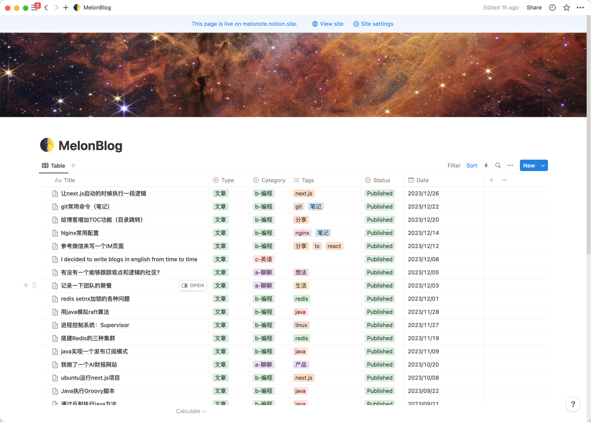
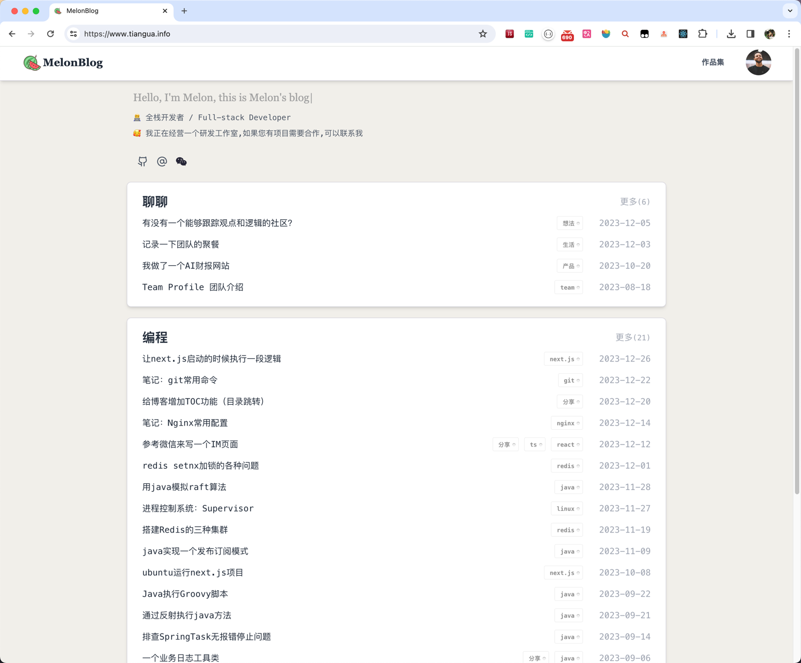
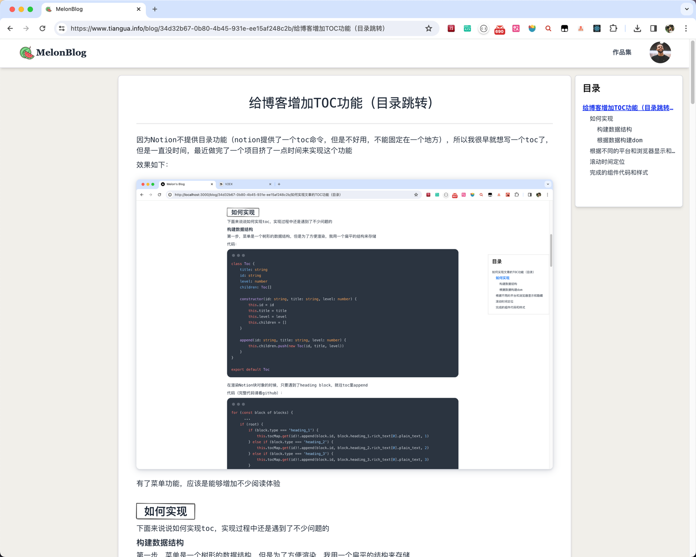

## 介绍
`melon-blog`是一个基于next.js + notion(笔记软件)的一个博客项目,项目可以直接在[vercel](http://vercel.com)上部署,不需要自己搭建服务器.

做这个项目最初的原因是想有一个简约风格的博客,并且能够使用notion来写文章内容,notion的api正好能够支撑这个需求.

体验地址: [melon-blog](http://www.tiangua.info)

## 部署

## 截图

## 讨论群
如果你对这个项目感兴趣,并切有一些想法,可以加我微信,备注melon-blog,我拉你进讨论群  

